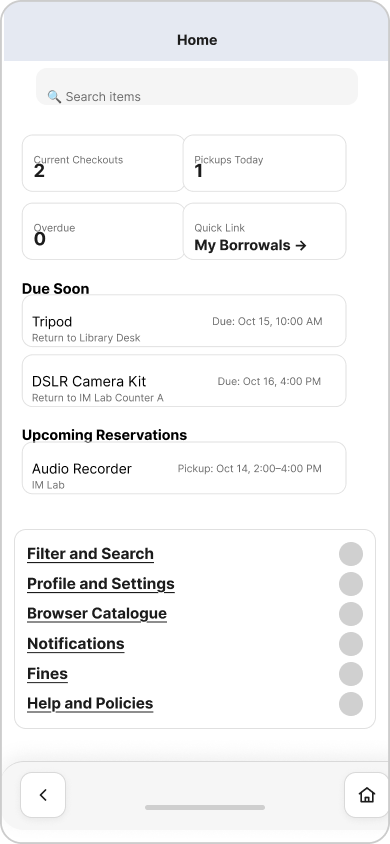

# UX Design

## Interactive Prototype
👉 **[View the mobile prototype](https://www.figma.com/proto/1ZvQrSffAvZ4PEpCATDmaz/CAMP-Wireframe?node-id=24-1356&p=f&t=tyV3M1MsOIwmPgH7-0&scaling=scale-down&content-scaling=fixed&page-id=0%3A1&starting-point-node-id=24%3A1356)**

This prototype demonstrates the MVP flows:
- Authentication & entry
- Dashboard and key actions
- Dynamic overlays (filters, forms, confirmations)
- Success and failure states for critical tasks

---

## App Map
**Figma (source):** [https://www.figma.com/board/OfJD2N2mf5sBN2t7kEPEP8/CAMP?node-id=34-965&p=f&t=tyV3M1MsOIwmPgH7-0](https://www.figma.com/board/OfJD2N2mf5sBN2t7kEPEP8/CAMP?node-id=34-965&p=f&t=tyV3M1MsOIwmPgH7-0)

---

## Wireframes (Mobile-first)
**Figma (source):** [https://www.figma.com/design/1ZvQrSffAvZ4PEpCATDmaz/CAMP-Wireframe?node-id=0-1&p=f&t=O7EOxAs2l2GvtmGn-0](https://www.figma.com/design/1ZvQrSffAvZ4PEpCATDmaz/CAMP-Wireframe?node-id=0-1&p=f&t=O7EOxAs2l2GvtmGn-0)

Below are exported PNGs. All share the intended same width; heights vary as needed.

### CAMP Add Item

### CAMP Automated Alerts

### CAMP Browser Catalogue

### CAMP Check in

### CAMP Check out

### CAMP Edit Item

### CAMP Filter and Search

### CAMP Fines

### CAMP Help and Policies

### CAMP Home

### CAMP Inventory

### CAMP Item Detail

### CAMP Join Waitlist

### CAMP Login

### CAMP Manage Fines

### CAMP My Borrowals

### CAMP Notification Centre

### CAMP Overdue Alert

### CAMP Overdue

### CAMP Pay Fines

### CAMP Payment History

### CAMP Payment Success

### CAMP Pickup Reminder

### CAMP Profile and Settings

### CAMP Reservation Confirmation

### CAMP Reservation

### CAMP Reserve Facility

### CAMP Reserve

### CAMP Return Reminder

### CAMP Review Reservation

### CAMP Staff Dashboard

### CAMP Tie

